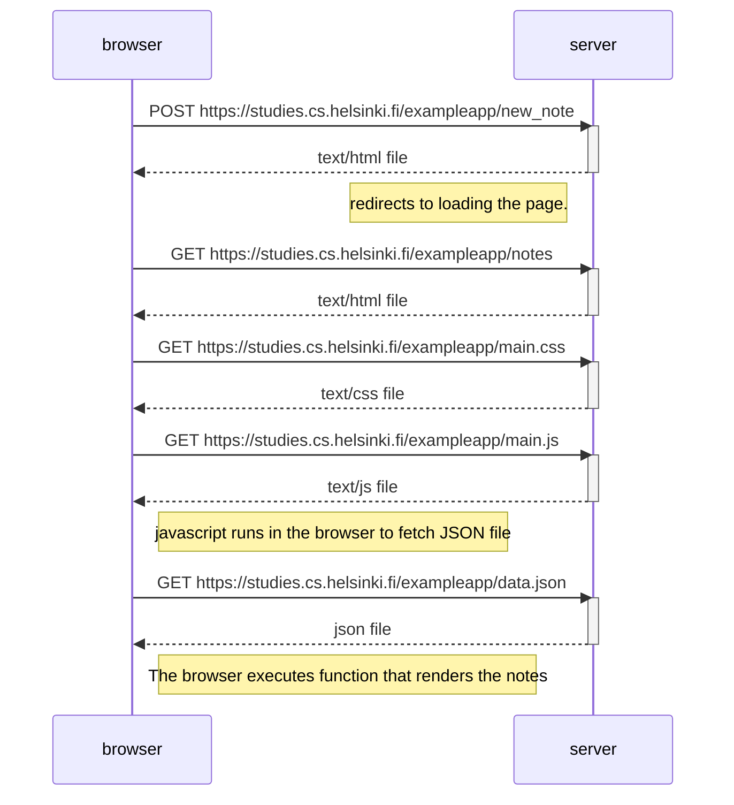
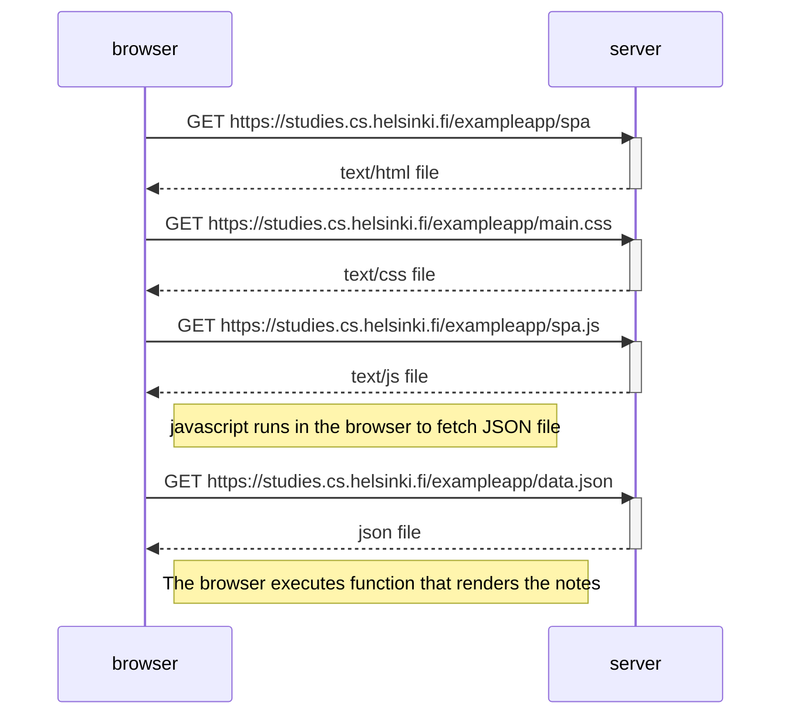
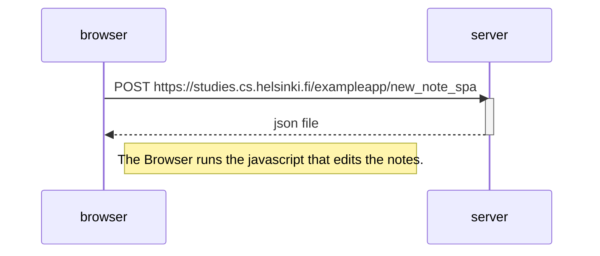

## For exercise 0.4

```mermaid
sequenceDiagram
    participant browser
    participant server

    browser->>server : POST https://studies.cs.helsinki.fi/exampleapp/new_note
    activate server
    server -->> browser: text/html file
    deactivate server
    note left of server: redirects to loading the  page.

    browser ->> server: GET https://studies.cs.helsinki.fi/exampleapp/notes
    activate server
    server -->> browser: text/html file
    deactivate server

    browser ->> server: GET https://studies.cs.helsinki.fi/exampleapp/main.css
    activate server
    server -->> browser: text/css file
    deactivate server

    browser ->> server: GET https://studies.cs.helsinki.fi/exampleapp/main.js
    activate server
    server -->> browser: text/js file
    deactivate server
    note right of browser: javascript runs in the browser to fetch JSON file

    browser ->> server: GET https://studies.cs.helsinki.fi/exampleapp/data.json
    activate server
    server -->> browser: json file
    deactivate server

   Note right of browser: The browser executes function that renders the notes
```

## For exercise 0.5

```mermaid
sequenceDiagram
    participant browser
    participant server

    browser->>server :GET https://studies.cs.helsinki.fi/exampleapp/spa
    activate server
    server -->> browser: text/html file
    deactivate server

    browser ->> server: GET https://studies.cs.helsinki.fi/exampleapp/main.css
    activate server
    server -->> browser: text/css file
    deactivate server

    browser ->> server: GET https://studies.cs.helsinki.fi/exampleapp/spa.js
    activate server
    server -->> browser: text/js file
    deactivate server
    note right of browser: javascript runs in the browser to fetch JSON file

    browser ->> server: GET https://studies.cs.helsinki.fi/exampleapp/data.json
    activate server
    server -->> browser: json file
    deactivate server

   Note right of browser: The browser executes function that renders the notes
```

## For exercise 0.6

```mermaid
sequenceDiagram
    participant browser
    participant server

    browser ->> server: POST https://studies.cs.helsinki.fi/exampleapp/new_note_spa
    activate server
    server -->> browser: json file
    deactivate server
    note right of browser: The Browser runs the javascript that edits the notes.
```
